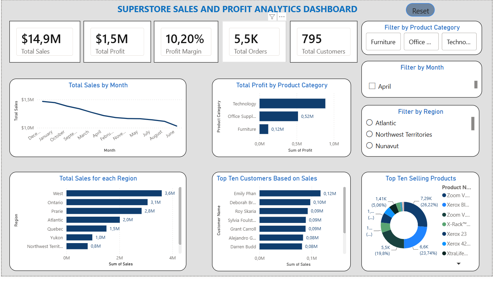
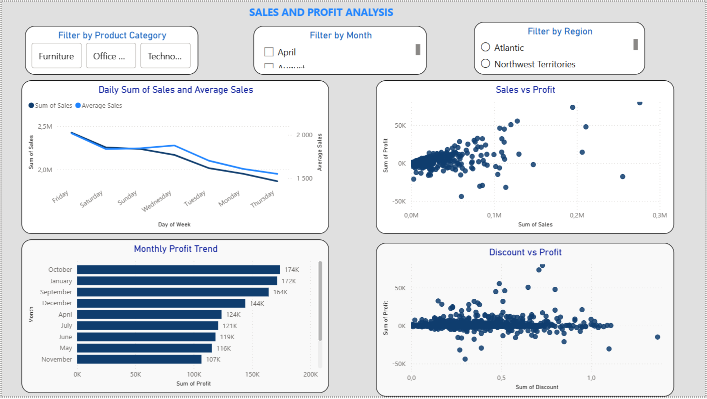
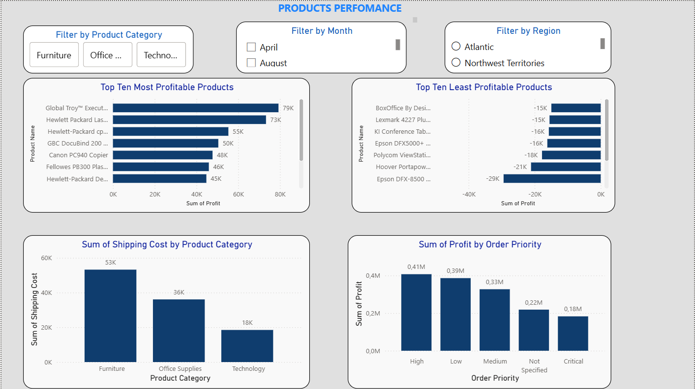
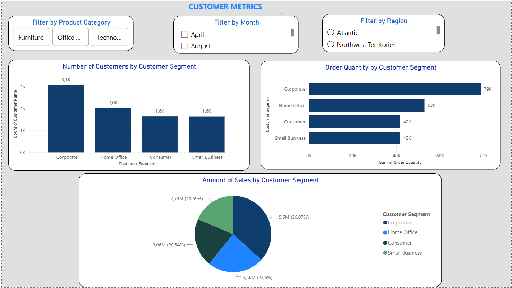

# Superstore(Retail) Sales Analytics Dashboard

## Project Overview

This project analyzes sales from a retail store that sells furniture, office supplies, and technological equipment to a variety of customers, including individual consumers, corporate clients, and small businesses.

The objective is to uncover insights into sales performance, profitability, customer behavior, and product performance. The analysis was conducted using Excel, Python, and Power BI** to simulate a real-world business intelligence workflow.

---

## Business Problem

Retail businesses generate thousands of transactions every month. Management needs to understand:

1. Which products generate the highest profit?
2. Which regions perform best?
3. Which customers contribute the most revenue?
4. How do discounts affect profitability?
5. What are the monthly sales trends?

The objective is to transform raw transactional data into actionable business insights.

---

## Tools Used

- Python
- Pandas
- NumPy
- Matplotlib
- Power BI
- Git
- GitHub

---

## Project Workflow

### 1. Data Cleaning
- Removed duplicates
- Handled missing values
- Converted data types
- Created new features (Year, Month, Profit Margin)

### 2. Exploratory Data Analysis (EDA)
- Sales analysis
- Profit analysis
- Customer analysis
- Product analysis
- Regional analysis
- Correlation analysis

### 3. Dashboard Development
- Executive KPI cards
- Monthly sales trend
- Sales by region
- Profit by category
- Top products
- Customer analysis
- Interactive filters

---

## Dashboard Preview

### Executive Dashboard

### Sales Analysis

### Product Performance

### Customer Analysis

---

## Key Findings & Insights

### 1. Sales vs Profit Relationship
- Higher sales do not always lead to higher profit.
- Some products generate strong sales but low or negative profit due to high discounts or low margins.

### 2. Impact of Discounts
- Increased discounts often lead to reduced profitability.
- Excessive discounting is a key factor behind negative profit in certain transactions.

### 3. Regional Performance
- Certain regions consistently outperform others in both sales and profit.
- Regional differences suggest varying customer behavior and market demand.

### 4. Product Performance
- A small number of products contribute a large portion of total revenue.
- Several products with high sales are not profitable and may require pricing or strategy review.

### 5. Customer Behavior
- A small group of customers generates a significant share of total sales.
- High-value customers are critical for overall revenue performance.
- Coorperate customers generate more revenue for the retail.

### 6. Category Performance
- Technology products tend to perform better in terms of profit compared to other categories.
- Office Supplies and Furniture show mixed profitability depending on discounts and sub-category.

### 7. Time-Based Trends
- Sales show fluctuations over time, indicating possible seasonal demand patterns.
- Certain months consistently perform better in terms of sales volume.

---

## Overall Conclusion

The analysis highlights that profitability is influenced more by **discount strategy, product mix, and customer segmentation** than by sales volume alone.

Businesses should focus on:
- Optimizing discount strategies
- Targeting high-value customers
- Reviewing loss-making products
- Improving regional performance strategies

---

## Skills Demonstrated

- Data Cleaning
- Data Analysis
- Exploratory Data Analysis
- Business Intelligence
- Dashboard Design
- Data Visualization
- Business Storytelling
- Python Programming
- Power BI Development

---

## 📁 Project Structure

RETAIL-SALES-ANALYTICS/
│
├── .venv/ # Virtual environment (Python)
├── .vscode/ # VS Code settings
│
├── data/ # Raw and cleaned datasets
│
├── images/ # Dashboard screenshots & visuals
│
├── powerbi/ # Power BI (.pbix) files
│
├── python/ # Python scripts for analysis and Workbook
│
├── reports/ # Final reports / documentation
│
├── README.md # Project documentation
└── requirements.txt # Python dependencies

---

##  Author

**Kefasi Vurumu**

Data Analyst | Python | SQL | Power BI | Excel
